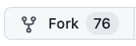
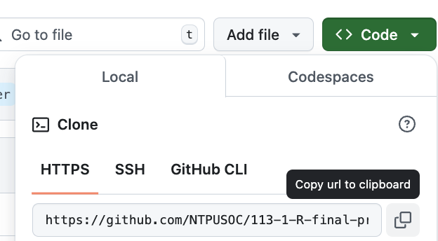
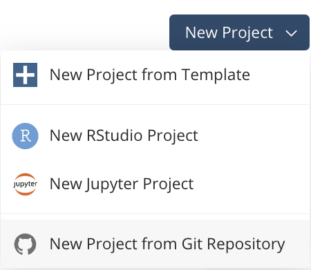
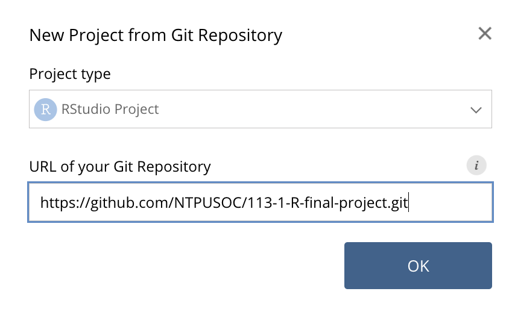

# Setup 

  1. Fork this repository: click  on the top right corner of this page. On the next page, click   
     點擊本頁右上角的 . 在點出來的新頁面點擊 
<!--
  2. Clone your forked repository url: click , then copy the HTTPS url.
  
 

   ***

  3. Create a POSIT project from the url: Open your POSIT, click "New Project" > "New Project from Git Repository".

  

  ***

  then paste the url as in the box:
    

-->
